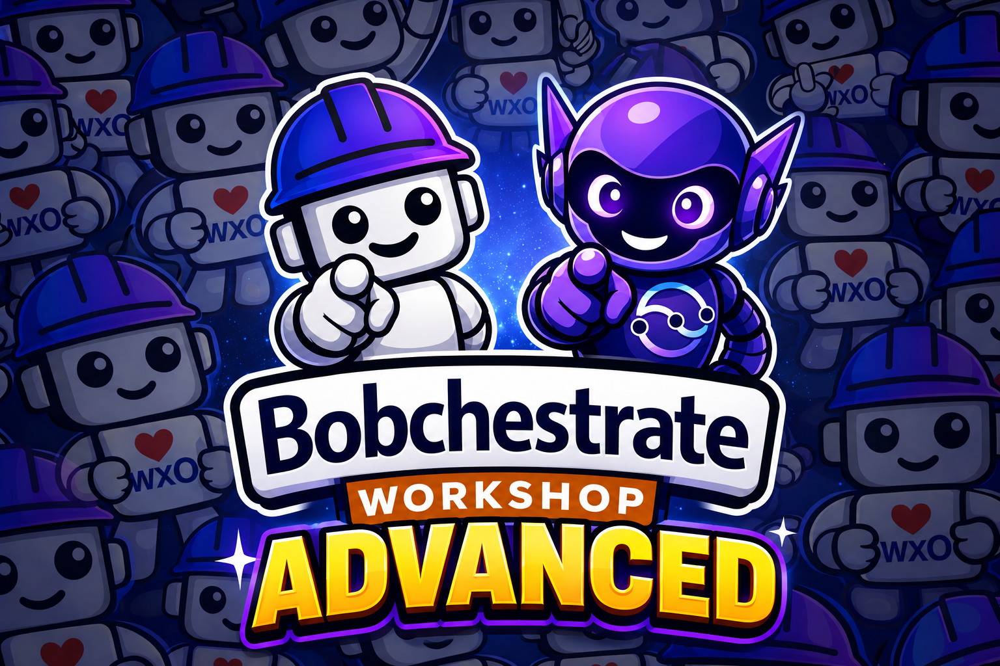

<p class="os-lockup" markdown>

</p>

# Event-Driven AI Agents with watsonx Orchestrate

<p align="center">
  
</p>

!!! quote "Openslava 2026 — hands-on lab"
    Build a production-shaped, **event-driven AI pipeline**: Kafka events are detected by
    Flink SQL, handed to a watsonx Orchestrate agent for reasoning, and the agent's
    schema-validated decision is published back onto a stream — all built with
    **IBM Bob** as your pair programmer.

## What you'll build

```text
POS sale events ──▶ Confluent Cloud (Kafka)
                       │
                       ▼
                  Flink SQL — velocity spike detector
                       │
                       ▼
             Python bridge ──▶ watsonx Orchestrate agent
                                 (tools + knowledge base)
                       │
                       ▼
             Schema-validated decision ──▶ Kafka topic
```

A fashion retailer needs to know — within seconds — when a product starts selling
abnormally fast, and what to do about it: rush reorder, surge price, transfer stock, or
just keep watching. By the end of the lab you will have that decision loop running
end to end.

| Component | Technology | Role |
| --- | --- | --- |
| Kafka topics | Confluent Cloud | Carry raw inventory events and velocity alerts |
| Velocity spike detector | Flink SQL | Flags products selling far above baseline |
| Python bridge | `confluent-kafka` + `httpx` | Reads alerts, calls the agent, publishes decisions |
| Inventory analysis agent | watsonx Orchestrate | Reasons about urgency, recommends actions, emits strict JSON |
| Knowledge base | watsonx Orchestrate KB | Decision rules, product history, guardrails |

## Agenda

| Section | Time | Difficulty |
| --- | --- | --- |
| [**Setup & Environment**](setup/index.md) — accounts, Bob IDE, workspace, ADK | 30 min | ⭐ |
| [**The Lab**](lab/index.md) — Confluent + Flink SQL + watsonx Orchestrate agent | 85–95 min | ⭐⭐⭐⭐ |
| [**Stretch exercises**](lab/exercises.md) — optional, go deeper | 20 min | ⭐⭐⭐ |

## Before you start

You need the following. The setup guide walks you through every one of them — don't install
anything ahead of the session unless you want to save time.

- [ ] Python **3.11–3.13**
- [ ] [`uv`](https://docs.astral.sh/uv/) package manager
- [ ] **IBM Bob IDE** + a Bob trial account
- [ ] A **watsonx Orchestrate** instance (free trial, or one provided by your instructor)
- [ ] A **Confluent Cloud** account — created during the lab with an instructor-supplied promo code, so **no credit card is needed**

!!! tip "Region matters"
    If you create your own watsonx Orchestrate trial, use **Frankfurt (eu-de)** so the
    Confluent connection steps later in the lab match what everyone else sees.

## How to use Bob in this lab

The workspace you download ships with a `.bob/` configuration that gives Bob three
layers of watsonx Orchestrate expertise:

- **WXO Agent Architect mode** — Bob's persona for this lab: it consults the live wxO docs
  before answering and can inspect your environment through the ADK MCP server.
- **`wxo-dev-rule-enhanced` rule** — always-on platform conventions, so generated code
  follows wxO best practice even outside that mode.
- **`wxo-langgraph` skill** — deep, on-demand reference knowledge that activates when
  the topic matches.

Ask Bob in full sentences, with context:

!!! success "Effective prompts"
    - *"Bob, create a Python tool for wxO that looks up a store location from a CSV."*
    - *"Bob, my agent response fails schema validation on `reasoning` — what does the schema require?"*
    - *"Bob, my `WXO_API_KEY` is correct but I get a 401 — what could cause that?"*

!!! failure "Less effective"
    - *"Bob, fix this"* — no context
    - *"Bob, make it work"* — nothing to go on

Keep one Bob session per topic. Start a new task when you switch to something unrelated.

## Getting help

- Ask Bob: *"Bob, I'm stuck on [specific issue]"*
- [watsonx Orchestrate ADK documentation](https://developer.watson-orchestrate.ibm.com/)
- [IBM watsonx Orchestrate product docs](https://www.ibm.com/docs/en/watsonx/watson-orchestrate)
- [Confluent Cloud documentation](https://docs.confluent.io/cloud/current/overview.html)
- Raise a hand — an instructor is in the room.

---

[Start with Setup →](setup/index.md){ .md-button .md-button--primary }
[Jump to the lab](lab/index.md){ .md-button }
