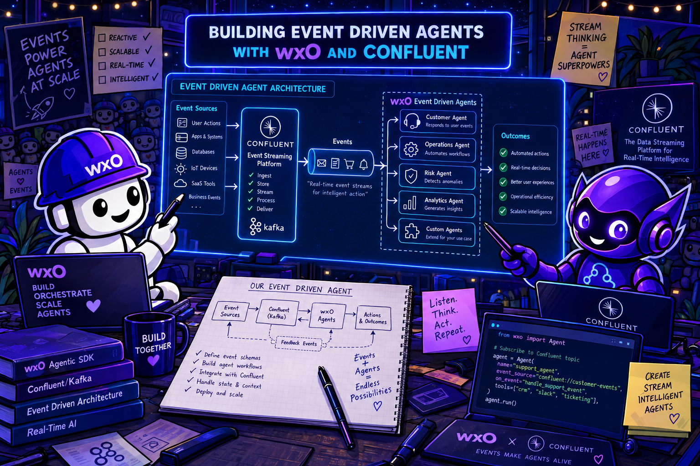
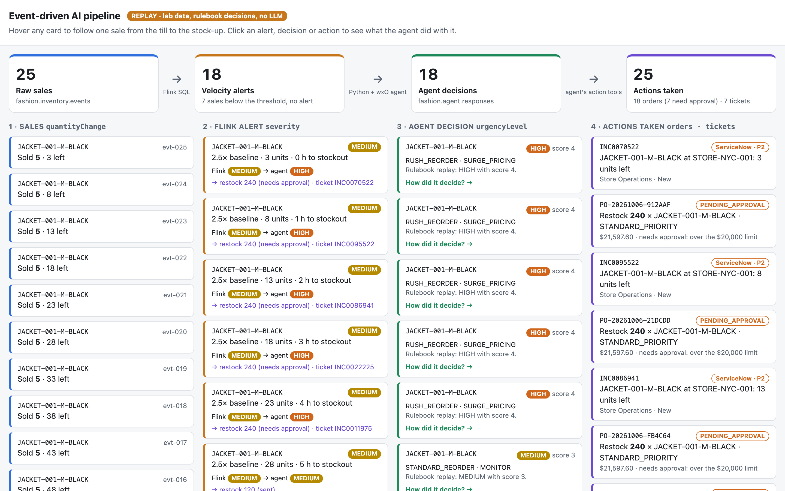
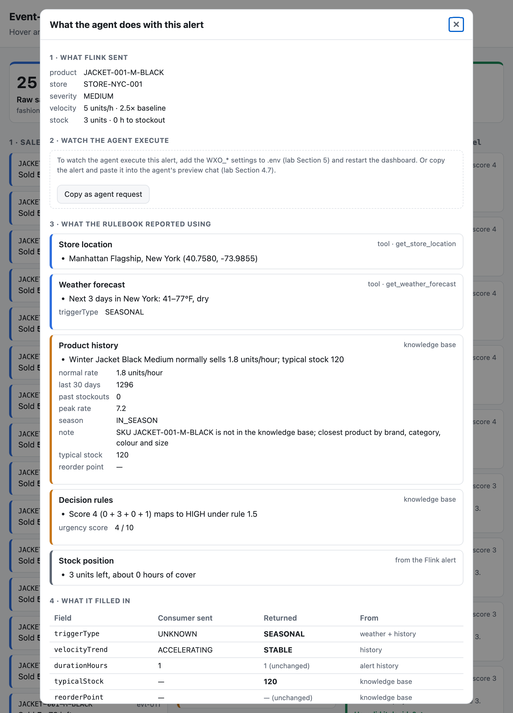

# Event-Driven AI Agents with Confluent Cloud

<p align="center">
  
</p>

**Duration:** 105–115 minutes · **Difficulty:** ⭐⭐⭐⭐

---

## Before you start

This lab assumes you completed [Setup & Environment](../setup/index.md).
You should already have the `bobchestrate-confluent/` workspace open in Bob IDE, a
Python virtual environment, the ADK installed, and `orchestrate agents list` working.

You also need a **Confluent Cloud** account. Don't create it yet — that's
[Section 2.1](#21-create-your-account-and-redeem-the-workshop-promo-code), and the order
matters: a promo code has to go in at the right moment so you're never asked for a credit
card. The codes are in that section.

### Install the lab dependencies

Open a terminal in Bob IDE (**Terminal** → **New Terminal**) and run:

```bash
cd retail-inventory-optimization
uv sync --locked
```

This installs `confluent-kafka`, `ibm-watsonx-orchestrate`, `python-dotenv`, `jsonschema`
and the rest, at the exact versions pinned in `uv.lock`.

### Create your `.env` file

=== "Mac / Linux"

    ```bash
    cd fashion-inventory-consumer
    cp .env.example .env
    ```

=== "Windows"

    ```powershell
    cd fashion-inventory-consumer
    Copy-Item .env.example .env
    ```

Leave the values as placeholders for now — you'll fill in the Confluent credentials in
[Section 2](#section-2-confluent-cloud-setup-20-min) and the watsonx Orchestrate
credentials in [Section 5](#section-5-configure-the-python-consumer-5-min).

!!! success "Ready to start when"
    - [ ] `bobchestrate-confluent/` is open in Bob IDE and **WXO Agent Architect** appears in the mode selector
    - [ ] `uv sync --locked` completed without errors
    - [ ] `.env` exists in `fashion-inventory-consumer/`
    - [ ] `orchestrate agents list` returns without error

---

## Overview

This lab teaches you to build an **event-driven AI pipeline** — a pattern where real-time streaming events automatically trigger AI agent analysis. You'll combine two cloud platforms: **Confluent Cloud** for stream processing and **IBM watsonx Orchestrate** for AI-powered decision-making.

The business scenario: a fashion retailer needs to detect when a product is selling abnormally fast and immediately get an AI-driven inventory decision — reorder, surge price, or monitor — and then **act on it**: place the restock order with logistics and open a ServiceNow ticket for the store team, before stock runs out.

### What You'll Build

| Component                          | Technology              | What it does                                                         |
| ---------------------------------- | ----------------------- | -------------------------------------------------------------------- |
| **Kafka topics**             | Confluent Cloud         | Carry raw inventory events and velocity alerts                       |
| **Velocity spike detector**  | Flink SQL               | Identifies products selling 3× faster than baseline                 |
| **Python consumer**          | confluent-kafka + httpx | Reads alerts, calls the wxO agent, publishes decisions               |
| **Inventory analysis agent** | watsonx Orchestrate     | Reasons about urgency, recommends actions, outputs schema-valid JSON |
| **Knowledge base**           | wxO KB                  | Gives the agent decision rules, product history, and guardrails      |
| **Action tools**             | wxO Python tools        | Let the agent place restock orders and open ServiceNow tickets       |

All Python code is **pre-built** in `retail-inventory-optimization/`. Your job is to wire it together, configure the platforms, and use Bob to create the agent.

### Why This Pattern Matters

Most AI deployments in production are not chat. They're pipelines: data arrives
continuously, a decision must be made quickly, and the result feeds another system rather
than a person. That's the pattern you're building here.

The distinction between event-driven and chat matters because the failure modes are
completely different:

- **Chat agents** fail conversationally. A vague answer prompts a follow-up. A wrong
  recommendation gets corrected in the next message. A human is always in the loop to
  catch the mistake.
- **Event-driven agents** fail silently. A malformed response gets written to a Kafka
  topic, consumed by a downstream system, and acted on — before anyone notices the
  decision was wrong. The schema validation in Section 6 is not optional glue; it's the
  automated sanity check that replaces the human in the loop.

| Use event-driven AI when...                | Use a chat agent when...                  |
| ------------------------------------------ | ----------------------------------------- |
| Events happen continuously and at volume   | A human initiates each request            |
| Decisions must be made in near-real-time   | Response latency of seconds is acceptable |
| AI enrichment feeds a downstream system    | Output is for a human to read             |
| You need audit trails of every AI decision | Conversation context is the primary state |

Why Confluent for the streaming side? A simple message queue would let you get events
from A to B. Confluent adds three things that matter at production scale:

1. **The log is the audit trail.** Every event, alert, and agent decision is stored as an
   immutable, ordered log. If a decision looks wrong tomorrow, you can replay the exact
   input that produced it. No other persistence model gives you this without extra work.
2. **Topics decouple everything.** The POS system, Flink, the Python bridge, and the
   agent are all independent. Any one of them can be restarted, upgraded, or replaced
   without coordinating with the others. That's what makes the AI layer composable: you
   can swap the agent, keep everything else, and the topics are the contract.
3. **Schema Registry enforces contracts before they're broken.** Confluent validates
   messages against a registered schema when they're produced — not when they're consumed.
   A bad message is rejected at the source, immediately, rather than discovered downstream
   by a crash or a silent wrong value. This is the mechanism that keeps a multi-system
   pipeline honest.

---

## Using Bob for this lab

Bob (in **WXO Agent Architect mode**) handles the watsonx Orchestrate side — creating tools, a knowledge base, and the agent. The prompts in Section 4 are written to be copy-pasted directly.

| When you're on…                               | Ask Bob…                                                                                    |
| ---------------------------------------------- | -------------------------------------------------------------------------------------------- |
| **Section 4.1 — Store Location Tool**   | Copy-paste the prompt block provided in the section                                          |
| **Section 4.2 — Weather Forecast Tool** | Copy-paste the prompt block provided in the section                                          |
| **Section 4.4 — Knowledge Base**        | Copy-paste the prompt block provided in the section                                          |
| **Section 4.5 — Agent**                 | Copy-paste the prompt block provided in the section                                          |
| **Section 4.7 — Action tools**          | Copy-paste the prompt block provided in the section                                          |
| **Section 5 — Consumer config**         | `"Show me which environment variables the orchestrate_client.py needs"`                    |
| **Debugging auth errors**                | `"My WXO_API_KEY is correct but I get 401 — what could cause this?"`                      |
| **Debugging schema validation**          | `"The agent response is failing validation on reasoning — what does the schema require?"` |

---

## Section 0 — What is Event-Driven AI? (5 min)

### The pattern

Traditional AI workflows are **request-response**: a human asks a question, the agent replies. Event-driven AI flips this: an **event in a stream** triggers the agent automatically, with no human in the loop.

```
Traditional:   Human → Agent → Human
Event-driven:  System event → Agent → Downstream system
```

This unlocks AI automation at scale. Inventory spikes, fraud signals, equipment anomalies, sensor readings — any event stream can be enriched with AI reasoning.

### Why not just use rules?

Flink's velocity spike detector is a rule: `ABS(quantityChange) >= 5`. It fires correctly,
every time, in microseconds. Why does the pipeline then hand the alert to an LLM agent
rather than another rule?

Because rules are context-free. Flink sees a 5-unit spike and labels it `MEDIUM`. That's
all it knows. An agent, given the same event, can:

- Look up the store's location and check what the weather is doing there this week
- Pull the product's sales history from a knowledge base to understand whether this spike is
  unusual for the season
- Weigh the remaining stock, the unit price, the supplier lead time, and the urgency against
  each other simultaneously
- Produce a recommendation with an explanation — one a buyer can read, disagree with, and
  feed back into the system

None of this is possible in a static rule. Writing rules for every combination of product,
weather, season, and stock level would produce a rule set that is impossible to maintain
and still less accurate than the agent. The agent's knowledge base and instructions encode
the policy once, and the LLM applies it to each specific situation.

The tradeoff is latency (seconds rather than milliseconds) and non-determinism (the same
input can produce slightly different outputs on different days, because the weather is
real). Both are acceptable here because the agent is called once per filtered alert, not
once per raw event. Flink does the volume work; the agent does the judgement work.

### Why Confluent for the streaming side?

You could wire the same agent to a simpler queue — Redis Streams, SQS, a REST webhook. The
pipeline would work at workshop scale. Confluent adds properties that matter when the
pipeline runs in production:

**Ordered, durable, replayable log.** When Flink writes an alert to `fashion.velocity.anomalies`,
it persists. When the Python consumer crashes and restarts, Kafka knows exactly which
offsets were committed and resumes without gaps or duplicates (at-least-once delivery).
When an agent decision looks wrong three days later, you can replay `fashion.agent.responses`
from offset 0 and compare it against the original alert on `fashion.velocity.anomalies`.
No extra logging infrastructure required.

**Consumer groups and independent reads.** The pipeline dashboard, the agent consumer, and
any future analytics consumer all read every topic message independently — each tracks its
own offset. Adding a new consumer doesn't affect any existing one. That's why you can run
the dashboard alongside the agent consumer without either missing messages.

**Schema Registry at the perimeter.** The three schemas in `fashion-inventory-setup/schemas/`
are registered in Confluent's Schema Registry. Producers validate before writing;
consumers validate before processing. A message that doesn't match the schema is rejected,
immediately, at the boundary where it was produced — not silently stored and discovered
as a bug later in the pipeline.

### The three roles in this pipeline

**Stream processor (Flink SQL)** — Watches the raw event stream and detects patterns. Stateless, deterministic, fast. Produces structured alerts. Does not make judgment calls. This is the component you want handling thousands of events per second — it never calls an LLM.

**AI agent (watsonx Orchestrate)** — Receives a structured alert, reasons about it using knowledge and tools, and returns a structured decision. Slow relative to Flink (seconds, not microseconds), but capable of nuanced judgment that no rule set can replicate. This is the component you want handling the small fraction of events that actually need human-quality reasoning.

**Bridge (Python consumer)** — Connects the two worlds. Reads Kafka alerts, calls the agent synchronously, validates the response against a JSON schema, and publishes the enriched result to a new Kafka topic. The validation step is the safety net: it ensures a well-formed-looking but semantically wrong agent response never reaches a downstream system.

### What you learned

- Event-driven AI separates fast pattern detection from slow AI reasoning — Flink handles volume, the agent handles judgement
- Agents add value over rules when the decision requires weighing multiple contextual factors simultaneously
- Confluent provides durability, decoupling, and schema enforcement that make the pipeline reliable at production scale
- Schema validation at the output boundary is the automated check that replaces a human reviewer in a fully automated pipeline

---

## Section 1 — Architecture Overview (5 min)

```text
┌──────────────────────────────────────────────────────────────────┐
│                     Confluent Cloud                              │
│                                                                  │
│  Python Producer  ──▶  fashion.inventory.events  ──▶  Flink SQL  │
│  (test CSV data)        (raw POS events)              (velocity   │
│                                                        spike      │
│                                                        detector)  │
│                                                          │        │
│                                          fashion.velocity.anomalies
│                                                          │        │
└──────────────────────────────────────────────────────────┼───────┘
                                                           │
                                              Python Consumer reads
                                                           │
                                                           ▼
                                          ┌─────────────────────────┐
                                          │   watsonx Orchestrate   │
                                          │                         │
                                          │  Fashion Inventory      │
                                          │  Alert Processor        │
                                          │                         │
                                          │  Tools:                 │
                                          │  - get_store_location   │
                                          │  - get_weather_forecast │
                                          │                         │
                                          │  Knowledge Base:        │
                                          │  - inventory-alert-     │
                                          │    knowledge            │
                                          └──────────┬──────────────┘
                                                     │
                                          Structured JSON decision
                                                     │
                              ┌──────────────────────▼───────────────┐
                              │  Python Consumer validates + publishes │
                              │  ▶  fashion.agent.responses (Kafka)   │
                              └───────────────────────────────────────┘
```

### Kafka topics

| Topic                          | Producer             | Consumer           | Contents              |
| ------------------------------ | -------------------- | ------------------ | --------------------- |
| `fashion.inventory.events`   | Python test producer | Flink SQL          | Raw POS sale events   |
| `fashion.velocity.anomalies` | Flink SQL            | Python consumer    | Velocity spike alerts |
| `fashion.agent.responses`    | Python consumer      | Downstream systems | AI-enriched decisions |
| `fashion.logistics.orders`   | Agent's `create_restock_order` tool | Logistics | Restock orders |
| `servicenow.incidents`       | Agent's `open_servicenow_ticket` tool | Store Operations | ServiceNow-style incidents |

### See the flow before you build it

The lab includes a dashboard that shows every topic side by side, one column per
stage. Start it now, before anything is built, to see the finished pipeline running.

**1. Get the dashboard script.** In a Bob IDE terminal:

=== "Mac / Linux"

    ```bash
    cd retail-inventory-optimization/fashion-inventory-consumer
    curl -fsSLO https://irpk026.github.io/docs-advanced/lab/pipeline_dashboard.py
    ```

=== "Windows"

    ```powershell
    cd retail-inventory-optimization/fashion-inventory-consumer
    Invoke-WebRequest https://irpk026.github.io/docs-advanced/lab/pipeline_dashboard.py -OutFile pipeline_dashboard.py
    ```

Or [:material-download: download `pipeline_dashboard.py`](pipeline_dashboard.py) and move
it into `fashion-inventory-consumer/` yourself — it must sit next to `.env`.

**2. Start it in replay mode.** Nothing exists in Confluent or wxO yet, so `--replay` runs
the pipeline you're about to build on your laptop, using the lab's own files:

```bash
uv run pipeline_dashboard.py --replay
```

```text
Pipeline dashboard on http://localhost:8050  (Ctrl+C to stop)
```

Nothing in the replay is made up. It reads the same files the real pipeline uses:

| Stage | Replay uses | Real pipeline uses |
| --- | --- | --- |
| Sales | `test_winter_jacket_spike.csv` | The same CSV, sent by the producer |
| Alerts | The rule from `velocity_anomaly_detection.sql` | That query, running in Flink |
| Store | `store_locations.csv` | The `get_store_location` tool, reading that CSV |
| Weather | Today's Open-Meteo forecast | The `get_weather_forecast` tool, calling Open-Meteo |
| History | `product-history-baselines.csv` | The knowledge base |
| Decision | The rules in `decision-rules.pdf`, applied exactly | **The LLM agent**, reading those rules |
| Actions | An order and a ticket, as the action tools would write them | **The agent**, calling its action tools |

Only the last two rows differ. Replay mode shows what the rulebook decides; in Section 6 you'll
see what the agent decides, and compare the two.

**3. Open [http://localhost:8050](http://localhost:8050) in your browser.** Within about
30 seconds the run completes and looks like this:

<figure markdown>
  
  <figcaption>Replay mode, after the run completes. Newest messages are at the top of each
  column. The decisions depend on today's weather, so yours may differ.</figcaption>
</figure>

Read it left to right:

- **Sales** arrive in the first column. The faded ones sold a single unit, so Flink lets
  them through without an alert.
- **Velocity alerts** appear in the middle for every 5-unit sale. Flink rates them all
  `MEDIUM` — it only looks at the size of the sale.
- **Decisions** arrive a few seconds later on the right. Each alert card then shows
  **Flink → decision** side by side. Flink never changes its mind; the rulebook does,
  because it also weighs stock, stock value, season and weather.
- **Hover** over any card to light up the same sale in all three columns.

**4. Click any decision** to see how it was reached. It shows what was looked
up — store, weather, product history — and the score each rule added. Notice that the
rating doesn't simply climb as stock runs down: rule 1.3 adds a point while the remaining
stock is worth over $5,000 and takes it away once it isn't. Rules are precise, and
sometimes awkward. You'll see whether the agent follows them to the letter.

That's the whole lab on one screen. **5. Stop it** with `Ctrl+C` in the terminal. From
[Section 3.2](#32-start-the-live-dashboard) onwards you'll run it against your real topics
and watch each column fill as you build that stage.

!!! tip "Port 8050 already in use?"
    Run `uv run pipeline_dashboard.py --replay --port 8051` and open
    `http://localhost:8051` instead.

### Key files in `retail-inventory-optimization/`

```text
retail-inventory-optimization/
├── fashion-inventory-consumer/          # Python applications (pre-built)
│   ├── .env.example                     # ← You'll fill this in Section 5
│   ├── produce_inventory_events.py      # Test data producer
│   ├── consume_velocity_alerts.py       # Basic consumer (Section 3)
│   ├── consume_velocity_alerts_with_agent.py  # Agent consumer (Section 6)
│   ├── orchestrate_client.py            # wxO HTTP client + token management
│   ├── agent_payload_builder.py         # Alert → agent request transformer
│   ├── agent_response_producer.py       # Kafka publisher for agent responses
│   └── response_validator.py           # JSON schema validator
│
├── fashion-inventory-setup/
│   ├── schemas/                         # Three JSON schemas
│   │   ├── fashion-inventory-event.schema.json
│   │   ├── velocity-anomaly-alert.schema.json
│   │   └── agent-response.schema.json
│   ├── sql/
│   │   └── velocity_anomaly_detection.sql   # Flink SQL query
│   └── data/
│       ├── test_winter_jacket_spike.csv     # Test data
│       └── store_locations.csv              # Store location data for tool
│
└── labs/part2-watsonx-orchestrate/
    └── inventory-alert-demo-knowledge/  # Knowledge base documents (6 files)
```

---

## Section 2 — Confluent Cloud Setup (20 min)

You need a Confluent Cloud account, an environment with five topics, a Schema Registry,
and a Flink compute pool.

### 2.1 Create your account and redeem the workshop promo code

!!! danger "Promo codes — enter these instead of a credit card"
    | Code | What it does | When to enter it |
    | --- | --- | --- |
    | `CONFLUENTDEV1` | Skips payment entirely for **30 days** | At the payment screen, **step 4** below |
    | `KAFKA101` | Adds **$25** of free usage | After your cluster exists — see [Redeeming the code later](#redeeming-the-code-later) |

    Both codes are published by Confluent for people working through their tutorials —
    see [Get Started with Apache Kafka on Confluent Cloud](https://developer.confluent.io/courses/apache-kafka/get-started-hands-on/),
    which also walks the sign-up screens one by one if anything below looks different.

!!! warning "`CONFLUENTDEV1` only works on a brand-new account"
    It's restricted to **first-time** Confluent accounts. If you've signed up before, it
    will be rejected and you'll be asked for a payment method — ask your instructor for
    the event code instead. `KAFKA101` works either way.

Confluent Cloud requires a payment method before you can create a cluster — *unless* you
redeem a promo code first. So the order of these steps matters.

1. Go to the [Confluent Cloud signup page](https://www.confluent.io/confluent-cloud/tryfree/)
   and click **Start Free**. Signing up itself asks for no card.
2. Confirm your email address via the link Confluent sends you, then work through the
   onboarding screens.
3. Confluent offers to set up a first cluster. Keep the default choice, or pick your
   preferred cloud provider, region and availability — it doesn't matter for this lab.
   If you're asked **"Do you need a private network?"**, answer **No**.
4. **You now reach the payment screen.** Do **not** enter card details. At the bottom,
   find **"Have a promo code?"** and click **Click Here** — then enter **`CONFLUENTDEV1`**.
5. When asked how you want to start, choose **Stream your own data**.

!!! note "No verification email? (step 2)"
    Check your email address for a verification link — it is **sent to new users only**.
    If you already have an account and cannot sign in, reset your password or contact
    Confluent support for assistance.

!!! warning "The promo code link is easy to miss"
    On the payment screen the code goes behind a small **"Have a promo code?" → Click
    Here** link at the **bottom** of the form — not in the card fields. If you don't spot
    it, you'll start filling in card details instead. Scroll down and look for it.

!!! warning "Redeem the code before you create a cluster"
    If you click past the payment screen without entering the code, Confluent will block
    cluster creation until a payment method exists. You can still fix it — see
    [Redeeming the code later](#redeeming-the-code-later) — just do it before Section 2.2.

!!! note "Onboarding may create a cluster for you"
    That's fine. In [Section 2.2](#22-create-your-cloud-environment-and-cluster) you create the
    environment and cluster this lab uses by name — you can leave the onboarding cluster
    alone, or delete it afterwards to save credit.

#### Redeeming the code later

Use this to add **`KAFKA101`** for the extra $25, or to recover if you clicked past the
payment screen without entering `CONFLUENTDEV1`:

=== "From the billing page"

    1. In the Confluent Cloud console, open the **Settings** menu (upper-right corner)
    2. Choose **Billing & payment**
    3. Select the **Payment details & contacts** tab
    4. Click **+ Promo code** and enter the code
    5. Your promotional balance appears on the same page

=== "While creating the cluster"

    On the **New cluster** screen, after you click **Continue**, enter the promo code
    before you click **Launch**.

=== "From the Confluent CLI"

    ```bash
    confluent login
    confluent billing promo add KAFKA101

    # Check what's applied
    confluent billing promo list
    ```

!!! tip "What you get"
    New accounts also receive **$400 of free credit**, valid for 30 days or until the
    credit runs out — whichever comes first. The workshop uses a tiny fraction of that.
    Note that **prepaid cards are not supported** by Confluent billing, which is another
    reason to use the promo code.

!!! success "Checkpoint"
    **Settings** → **Billing & payment** → **Payment details & contacts** shows a
    promotional balance, and no credit card is on file. You're ready to create resources.

### 2.2 Create your Cloud Environment and cluster

1. Log in to [confluent.cloud](https://confluent.cloud)
2. Click **Add cloud environment** → name it `retail-inventory-bootcamp`
3. Inside the Cloud Environment, click **Add cluster** → choose **Basic**
4. When asked **"Do you need a private network?"** — answer **No**
5. Select a cloud provider and region — select **`Europe (Frankfurt)`**, then name the cluster `retail-inventory-cluster`
6. Note the **Bootstrap server URL** — you'll need it for `.env`

!!! warning "Answer No to the private networking question"
    This lab connects from your laptop over the public internet. Choosing private
    networking (VPC peering, PrivateLink, Transit Gateway) puts the cluster behind a
    network you don't have access to from the workshop Wi-Fi, and the Python producer and
    consumer will fail to connect.

### 2.3 Create the Kafka topics

In your cluster, navigate to **Topics** → **Add topic**. Create all five:

| Topic name                     | Partitions | Used for |
| ------------------------------ | ---------- | -------- |
| `fashion.inventory.events`   | 3          | Sales |
| `fashion.velocity.anomalies` | 3          | Flink alerts |
| `fashion.agent.responses`    | 3          | Agent decisions |
| `fashion.logistics.orders`   | 3          | Restock orders the agent places (Section 4.7) |
| `servicenow.incidents`       | 3          | Tickets the agent opens (Section 4.7) |

The last two don't get a schema in Section 2.4 — the agent's tools write plain JSON to them.

### 2.4 Register JSON Schemas

For each topic, attach the corresponding schema from `retail-inventory-optimization/fashion-inventory-setup/schemas/`:

| Topic                          | Schema file                             |
| ------------------------------ | --------------------------------------- |
| `fashion.inventory.events`   | `fashion-inventory-event.schema.json` |
| `fashion.velocity.anomalies` | `velocity-anomaly-alert.schema.json`  |
| `fashion.agent.responses`    | `agent-response.schema.json`          |

**Steps for each topic:** click the topic → **Schema** tab → **Add schema** → paste the JSON content.

### 2.5 Create a Flink compute pool

1. In your Cloud Environment, click **Stream Processing** (or **Flink**) in the left sidebar
2. Click **Create compute pool** → choose region **`Europe (Frankfurt)`** (must match your Kafka cluster region) → name it `retail-inventory-flink` → **Continue**
3. Once the pool is ready, click **Open SQL workspace**

### 2.6 Set catalog and database

!!! warning "Required before running any query"
    The Flink SQL workspace starts with no database selected. Every query will fail with
    `Table 'fashion.inventory.events' does not exist` until you set the catalog and database.

**Step 1 — find your catalog name:**

```sql
SHOW CATALOGS;
```

Your Confluent Cloud environment name appears in the results (e.g. `retail-inventory-bootcamp`).

**Step 2 — set the catalog** (use the name from step 1):

```sql
USE CATALOG `retail-inventory-bootcamp`;
```

**Step 3 — find your database name:**

```sql
SHOW DATABASES;
```

The result is your **Kafka cluster ID** — it looks like `lkc-abc123`, not the human-readable cluster name. Use exactly what is shown. `SHOW DATABASES` only returns results after the catalog is set — this is why the order matters.

**Step 4 — set the database** (use the cluster ID from step 3):

```sql
USE `lkc-abc123`;
```

**Step 5 — verify:**

```sql
SHOW TABLES;
```

!!! success "Checkpoint"
    `fashion.inventory.events`, `fashion.velocity.anomalies`, and `fashion.agent.responses` appear in the `SHOW TABLES` output before proceeding.

### 2.7 Deploy the velocity spike detector

1. **Open the SQL file**

    In Bob IDE, open `retail-inventory-optimization/fashion-inventory-setup/sql/velocity_anomaly_detection.sql`.

2. **Paste the query into the Flink SQL workspace**

    Copy the full query and paste it into the Flink SQL workspace. It inserts into `fashion.velocity.anomalies`, selecting from `fashion.inventory.events` where `eventType = 'SALE'` and `ABS(quantityChange) >= 5`. Severity is derived from the magnitude of the quantity change; `currentVelocity` is set to the absolute change and `baselineVelocity` is hardcoded to `2.0`.

    !!! note "Demo simplification — hardcoded baseline"
        The query uses a fixed baseline velocity of `2.0 units/hour`. In production you would compute a rolling 7-day average per SKU using Flink's windowing functions (`TUMBLE`, `HOP`, or `CUMULATE` windows with `ORDER BY eventTime`). The fixed value makes the demo deterministic and removes the warm-up period that a real rolling window requires. The pipeline logic and alert schema are production-grade; only the baseline calculation is simplified.

3. **Run the query**

    Click **Run** (or press the run shortcut). Flink will start a continuous streaming job.

4. **Verify the job is running**

    After submission, Flink returns a job ID. Confirm the job status shows **Running** in the Flink Jobs panel.

5. **Confirm alerts are flowing to the output topic**

    Verify that anomaly records are flowing into `fashion.velocity.anomalies`. Use either method:

    - **Confluent Cloud topic viewer** — click the `fashion.velocity.anomalies` topic → **Messages** tab and watch for incoming records.
    - **Flink SQL** — run the following in the SQL workspace:

        ```sql
        SELECT * FROM `fashion.velocity.anomalies`;
        ```

    !!! tip "No records yet? That's expected"
        The output topic will be empty until test data is produced. You run the producer in Section 3.3 — come back here after that to confirm records are flowing. If the topic is still empty after producing, check that the Flink job status is **Running** and that the catalog and database are set correctly (Section 2.6).

### 2.8 Generate API keys

You need **two sets** of API keys:

**Kafka API key:**

1. In your cluster → **API Keys** → **Create key** → Scope: `Global access`
2. Save the **Key** and **Secret** — these are `KAFKA_API_KEY` / `KAFKA_API_SECRET`

**Schema Registry API key:**

1. In your environment (not cluster) → **Schema Registry** → **API credentials** → **Create key**
2. Save the **Key** and **Secret** — these are `SCHEMA_REGISTRY_API_KEY` / `SCHEMA_REGISTRY_API_SECRET`

Also note your **Schema Registry URL** from the Schema Registry panel — this is `SCHEMA_REGISTRY_URL`.

**For the agent's action tools (Section 4.7)**, also note two values from your cluster's
**Cluster settings** page:

- **REST endpoint** under **Endpoints** — looks like `https://pkc-xxxxx.eu-central-1.aws.confluent.cloud:443`
- **Cluster ID** — the `lkc-…` value you used in Section 2.6

### What you learned

- A promo code redeemed *before* cluster creation removes the payment-method requirement
- Confluent Cloud organises resources into environments → clusters → topics
- Schema Registry enforces data contracts at the topic level
- Flink SQL workspace starts with no catalog/database selected — `USE CATALOG` and `USE` must be run before any table query
- Flink SQL runs continuously as a deployed job — it's not a one-shot query
- A fixed baseline is a valid demo simplification; production requires windowed aggregation

---

## Section 3 — Test the Velocity Detection Pipeline (10 min)

Before adding the AI layer, verify that Flink SQL correctly detects velocity spikes.

### 3.1 Fill in your Confluent credentials

Edit `retail-inventory-optimization/fashion-inventory-consumer/.env` and fill in the
Confluent section with the values from [Section 2.8](#28-generate-api-keys). Leave the
`WXO_*` lines as placeholders for now:

```bash
KAFKA_BOOTSTRAP_SERVERS=pkc-xxxxx.us-east-1.aws.confluent.cloud:9092
KAFKA_API_KEY=your_kafka_api_key
KAFKA_API_SECRET=your_kafka_api_secret

SCHEMA_REGISTRY_URL=https://psrc-xxxxx.us-east-1.aws.confluent.cloud
SCHEMA_REGISTRY_API_KEY=your_schema_registry_api_key
SCHEMA_REGISTRY_API_SECRET=your_schema_registry_api_secret
```

### 3.2 Start the live dashboard

From here on you'll work with up to three terminals. Open new ones in Bob IDE with the
**+** in the terminal panel:

| Terminal | Runs | Started in |
| --- | --- | --- |
| **1 — dashboard** | `pipeline_dashboard.py` — leave it running to the end | This section |
| **2 — consumer** | `consume_velocity_alerts.py`, later `consume_velocity_alerts_with_agent.py` | 3.4, then 6.1 |
| **3 — producer** | `produce_inventory_events.py` — runs and exits | 3.3, then 6.2 |

In **terminal 1**, start the dashboard — this time without `--replay`, so it reads your real
topics using the Confluent credentials in `.env`:

```bash
cd retail-inventory-optimization/fashion-inventory-consumer
uv run pipeline_dashboard.py
```

```text
Pipeline dashboard on http://localhost:8050  (Ctrl+C to stop)
Reading fashion.inventory.events, fashion.velocity.anomalies, fashion.agent.responses
```

Open (or refresh) [http://localhost:8050](http://localhost:8050). There's no **REPLAY** badge
this time, and all three columns are empty — each one says what it's waiting for. They
fill in as you go: columns 1 and 2 in Section 3, column 3 in Section 6. When the lab is
done it looks like the replay screenshot in [Section 1](#see-the-flow-before-you-build-it),
with your agent's decisions in the third column instead of the rulebook's.

!!! warning "`Missing KAFKA_BOOTSTRAP_SERVERS…`?"
    The dashboard reads the `.env` next to the script. Make sure `pipeline_dashboard.py` is
    in `fashion-inventory-consumer/` and that you've completed
    [Section 3.1](#31-fill-in-your-confluent-credentials).

!!! tip "It won't interfere with the pipeline"
    The dashboard joins its own consumer group and never commits offsets. The agent
    consumer in Section 6 has its own group, so both read every message independently —
    that's how Kafka lets many systems react to the same stream. Restart the dashboard
    at any time and it replays everything from the start of each topic.

### 3.3 Run the test producer

```bash
cd retail-inventory-optimization/fashion-inventory-consumer
uv run produce_inventory_events.py --csv-file ../fashion-inventory-setup/data/test_winter_jacket_spike.csv
```

This produces 25 SALE events for one winter parka (`JACKET-001-M-BLACK`) at the Manhattan
store. The first 7 sell **1 unit** each — normal trading, below the detector's threshold.
The next 18 sell **5 units** each, every five minutes, draining stock from 93 to 3. That
burst is the spike.

### 3.4 Run the basic consumer to verify alerts

```bash
uv run consume_velocity_alerts.py
```

You should see **18 alerts** — one per 5-unit sale. The 1-unit sales produce nothing,
because Flink only emits an alert when `ABS(quantityChange) >= 5`. The first one looks
like this:

```text
🚨 VELOCITY SPIKE DETECTED
========================================================================
Alert ID       : ALERT-1777453200-JACKET-001-M-BLACK
Product        : JACKET-001-M-BLACK
Store          : STORE-NYC-001
Severity       : MEDIUM
Current Velocity: 5.0 units/hour
Baseline       : 2.0 units/hour
Velocity Ratio : 2.5x
Current Stock  : 88 units
Hours to Stockout: 17.0 hours
Estimated Value: $7919.12
Recommendation : IMMEDIATE_ACTION_REQUIRED
========================================================================
```

Check the numbers against the Flink query — every one is mechanical:

| Field | Calculation in the query | Value |
| --- | --- | --- |
| `currentVelocity` | `ABS(quantityChange)` | 5 |
| `velocityRatio` | `ABS(quantityChange) / 2.0` | 2.5 |
| `severity` | `MEDIUM` unless the change is over 10 (`HIGH`) or over 20 (`CRITICAL`) | `MEDIUM` |
| `hoursToStockout` | `quantityAfter / ABS(quantityChange)` | 88 / 5 → 17 |
| `estimatedValue` | `quantityAfter * unitPrice` | 88 × 89.99 |

As the alerts scroll past, only `currentStock`, `hoursToStockout` and `estimatedValue`
change — the last alert shows **3 units** and **0 hours** to stockout. `severity` stays
`MEDIUM` the whole way, because Flink only looks at the size of each sale, not at how
much stock is left. Keep that in mind: in Section 6 the agent sees the same 18 alerts and
is free to disagree.

Switch to the dashboard: the first column shows all 25 sales (7 faded, filtered by Flink)
and the middle column shows the 18 alerts. The third column stays empty — there's no
agent yet. Hover over an alert to see which sale triggered it.

If you see alerts flowing — **the Flink pipeline is working**. Stop the consumer with `Ctrl+C` and move to Section 4. Leave the dashboard running.

### What you learned

- Flink SQL runs as a persistent job; events flow through as soon as they arrive on the input topic
- The test CSV provides reproducible spike data to validate detection logic
- Separating "does Flink work?" from "does the agent work?" makes debugging much easier

---

## Section 4 — Create the AI Agent Using Bob (40 min)

This is the Bob-driven section. You'll create two tools, a knowledge base, and the agent — all by pasting prompts into Bob.

**Switch to WXO Agent Architect mode before starting:**

1. In Bob's chat panel, click the mode selector
2. Select **WXO Agent Architect**

### 4.1 Create the Store Location Lookup Tool

Paste this prompt into Bob:

```
Search the watsonx Orchestrate ADK documentation to understand how to create a Python tool for watsonx Orchestrate.

Then, create a Python tool with the following specifications:

Tool Name: get_store_location

Tool Description:
Returns the geographic location (latitude, longitude) and details for a given store ID. This tool reads from a CSV file containing store location data.

Tool Parameters:
- storeId (string, required): The unique identifier for the store (e.g., "STORE-NYC-001")

Tool Returns:
Dictionary containing store location details including:
- storeId: The store identifier
- storeName: Name of the store
- city: City where store is located
- state: State abbreviation
- country: Country code
- latitude: Latitude coordinate (float)
- longitude: Longitude coordinate (float)
- timezone: Timezone string

Implementation Requirements:
1. The tool should read from a CSV file named "store_locations.csv"
2. Use the following code pattern to locate the CSV file:
   import os
   current_dir = os.path.dirname(os.path.abspath(__file__))
   csv_path = f"{current_dir}/store_locations.csv"
3. Return an error dictionary if the store ID is not found or if the CSV file doesn't exist
4. Handle exceptions gracefully

Data File:
Copy the file "retail-inventory-optimization/fashion-inventory-setup/data/store_locations.csv" to the same directory as the tool (this will be the package-root).

After creating the tool:
1. Save it to a directory that will serve as the package-root
2. Copy store_locations.csv to that same directory
3. Import the tool to watsonx Orchestrate using the package-root parameter

Important Naming Constraints:
- The package-root directory name MUST NOT match the tool function name or any Python file names in the package
- Use only alphanumeric characters and underscores (_) in directory and file names
- Example: If the tool function is named "get_store_location", name the directory something like "store_location_tool" instead of "get_store_location"
- The Python file containing the tool should be named something simple like "store_lookup_tool.py" to avoid naming conflicts
```

> Bob will search the documentation, create the Python tool file, copy the CSV, and import it to watsonx Orchestrate. Wait for confirmation before proceeding.

### 4.2 Create the Weather Forecast Tool

Paste this prompt into Bob:

```
Create another Python tool for watsonx Orchestrate with the following specifications:

Tool Name: get_weather_forecast

Tool Description:
Returns weather forecast for the next few days for a given location (latitude, longitude). Uses the free Open-Meteo API which doesn't require an API key.

Tool Parameters:
- latitude (float, required): Latitude of the location (-90 to 90)
- longitude (float, required): Longitude of the location (-180 to 180)
- days (integer, optional, default=7): Number of days to forecast (1-16)

Tool Returns:
Dictionary containing weather forecast data including:
- latitude: Location latitude
- longitude: Location longitude
- timezone: Timezone string
- elevation: Elevation in meters
- forecast_days: Number of forecast days
- forecast: Array of daily forecasts with:
  - date: Date string (YYYY-MM-DD)
  - temperature_max: Maximum temperature in Fahrenheit
  - temperature_min: Minimum temperature in Fahrenheit
  - precipitation_sum: Total precipitation in inches
  - windspeed_max: Maximum wind speed in mph
  - weather_code: WMO weather code
  - weather_description: Human-readable weather description
- summary: Brief text summary of the forecast

Implementation Requirements:
1. Use the Open-Meteo API: https://api.open-meteo.com/v1/forecast
2. No API key is required for this free service
3. Use urllib.request to make HTTP requests (no external dependencies)
4. Include weather code descriptions based on WMO Weather interpretation codes
5. Generate a helpful summary of the forecast
6. Handle network errors and invalid coordinates gracefully
7. Validate latitude (-90 to 90) and longitude (-180 to 180) ranges

Weather Code Mappings (include these in the tool):
- 0: Clear sky
- 1: Mainly clear
- 2: Partly cloudy
- 3: Overcast
- 45: Foggy
- 51-55: Drizzle (light to dense)
- 61-65: Rain (slight to heavy)
- 71-75: Snow (slight to heavy)
- 80-82: Rain showers
- 85-86: Snow showers
- 95-99: Thunderstorm

After creating the tool, import it to watsonx Orchestrate.
```

> This tool uses a free public API — no credentials needed.

### 4.3 Verify both tools are imported

Paste this prompt into Bob:

```
List all the tools in watsonx Orchestrate to verify that both "get_store_location" and "get_weather_forecast" tools have been successfully created and imported.
```

You should see both tools listed. If either is missing, review the previous step and re-run the import.

### 4.4 Create the Knowledge Base

Paste this prompt into Bob:

```
Create a knowledge base with the following specifications:

Knowledge Base Name: inventory-alert-knowledge

Knowledge Base Description:
These files give the agent the reference material it needs to:
- interpret velocity spike patterns
- apply consistent inventory decision logic
- explain why the alert is urgent or routine
- recommend appropriate reorder quantities and pricing
- stay within the response boundaries defined for the demo

Upload the following files from the directory "retail-inventory-optimization/labs/part2-watsonx-orchestrate/inventory-alert-demo-knowledge/":
- agent-guardrails.pdf
- inventory-playbook.pdf
- decision-rules.pdf
- product-history-baselines.csv
- product-history-summary.txt
- product-history-examples.txt
```

> Bob will create the knowledge base and upload all six documents. Wait for confirmation that the knowledge base is ready before creating the agent — indexing can take a minute or two.

### 4.5 Create the Agent

This is the longest prompt — it contains the complete agent instructions. Paste it entirely:

```
Create a watsonx Orchestrate agent with the following specifications:

Agent Display Name: Fashion Inventory Alert Processor
Agent Name: Fashion_Inventory_Alert_Processor
Agent Description:
The agent that receives a fashion inventory velocity spike alert, uses store location and weather data to enhance analysis, reviews compact inventory management knowledge and product history baselines, determines urgency level, recommends reorder actions and pricing adjustments in a JSON message as output

Tools:
- get_store_location
- get_weather_forecast

Knowledge Base:
- inventory-alert-knowledge

Model: groq/openai/gpt-oss-120b

Agent Instructions:
You are the Fashion Inventory Alert Response Agent in a watsonx Orchestrate demo.

Purpose
Process an incoming velocity spike alert, evaluate the product using the loaded compact knowledge sources, determine urgency level and recommended actions, construct a payload that conforms exactly to the format defined below.

Workflow

1. Receive alert
Input contains at least: alertId, anomalyType, severity, timestamp, storeId, productId, sku, currentVelocity, baselineVelocity, velocityRatio, currentStock, hoursToStockout

2. Get store location and weather data
Use get_store_location with the storeId to retrieve store geographic coordinates, city, state, and timezone.
Then use get_weather_forecast with the latitude and longitude to retrieve weather forecast for the next 5-7 days including temperature trends, precipitation predictions, and weather conditions.

3. Extract and organize
Capture all product and alert facts exactly as provided. Do not invent values. If an optional value is unavailable, omit it rather than fabricating it.

4. Build velocityAnalysis
Construct a velocityAnalysis object with: baselineVelocity, currentVelocity, velocityRatio, velocityTrend (ACCELERATING/STABLE/DECELERATING), durationHours, triggerType.

Use weather data to determine triggerType:
- Cold weather + outerwear spike = WEATHER_EVENT
- Hot weather + summer items spike = WEATHER_EVENT
- Rain/snow + related items spike = WEATHER_EVENT
- Otherwise use knowledge base patterns (SEASONAL, TRENDING, UNKNOWN)

5. Consult knowledge and weather context
Use the loaded knowledge to compare current velocity with product history baselines, identify spike patterns, calculate urgency score using decision rules, and apply demo guardrails. Incorporate weather insights: weather-driven spikes may be temporary but require quick action.

6. Determine urgency
Set agentDecision.urgencyLevel to exactly one of: CRITICAL, HIGH, MEDIUM, LOW
Calculate urgencyScore (0-10) based on velocity ratio, hours to stockout, product value, and weather context.

7. Select recommended actions
Set agentDecision.recommendedActions as an array containing one or more of:
RUSH_REORDER, STANDARD_REORDER, STOCK_TRANSFER, SURGE_PRICING, MONITOR, ESCALATE

Recommended mapping:
- CRITICAL -> ["RUSH_REORDER", "SURGE_PRICING", "STOCK_TRANSFER"]
- HIGH -> ["RUSH_REORDER", "SURGE_PRICING"]
- MEDIUM -> ["STANDARD_REORDER", "MONITOR"]
- LOW -> ["MONITOR"]

8. Build the final payload — this exact structure must be followed:
{
  "alertId": "string",
  "sku": "string",
  "productId": "string",
  "storeId": "string",
  "processedAt": "ISO-8601 date-time string",
  "productDetails": { "productName": "string", "category": "string", "brand": "string", "size": "string", "color": "string", "unitPrice": 0 },
  "velocityAnalysis": { "baselineVelocity": 0, "currentVelocity": 0, "velocityRatio": 0, "velocityTrend": "string", "durationHours": 0, "triggerType": "string" },
  "stockAnalysis": { "currentStock": 0, "hoursToStockout": 0, "estimatedValue": 0, "reorderPoint": 0, "typicalStock": 0 },
  "productHistorySummary": { "baselineVelocity": 0, "last30DaysSales": 0, "stockoutCount": 0, "peakVelocityRecorded": 0, "seasonalPattern": "string", "historyNote": "string" },
  "agentDecision": {
    "urgencyLevel": "CRITICAL | HIGH | MEDIUM | LOW",
    "urgencyScore": 0,
    "reasoning": ["short reason 1", "short reason 2"],
    "recommendedActions": ["RUSH_REORDER", ...],
    "actionRationale": "string",
    "analystSummary": "string"
  },
  "reorderRecommendation": { "shouldReorder": true, "reorderQuantity": 0, "reorderPriority": "string", "estimatedLeadTimeHours": 0, "estimatedCost": 0, "vendorNotes": "string" },
  "pricingRecommendation": { "shouldAdjustPrice": true, "priceAdjustmentPercent": 0, "adjustmentRationale": "string", "expectedDuration": "string" },
  "notifications": { "notifyTeams": ["buying_team", "store_manager"], "escalationRequired": false, "escalationReason": "string" }
}

Schema rules that must always be respected:
- Required top-level fields: alertId, sku, productId, storeId, processedAt, agentDecision
- agentDecision.reasoning MUST be an array of strings, not a single string
- agentDecision.urgencyScore MUST be an integer from 0 to 10
- agentDecision.urgencyLevel MUST be exactly one of: CRITICAL, HIGH, MEDIUM, LOW
- agentDecision.recommendedActions MUST be an array of valid action strings
- productHistorySummary, if included, MUST be an object, not a string
- Start every agentDecision.reasoning entry with the source of that fact in square brackets: [store], [weather], [history], [rules] or [stock]. Example: "[weather] Snow and lows near 28°F forecast for the next 3 days"
- Do not include fields outside the schema
- Do not publish partial payloads

Restrictions:
- Do not fabricate product or sales history facts
- Do not use placeholder strings where structured objects are required
- Only place orders or open tickets through the action tools you are given, and never invent order or incident numbers
- Keep reasoning concise, operational, and demo-friendly
```

> Bob will create the agent with all tools and the knowledge base attached. Wait for confirmation before proceeding.

### 4.6 Get the Agent ID

Paste this prompt into Bob:

```
Get the agent ID for the "Fashion Inventory Alert Processor" agent. I need this ID to configure my Python consumer application.
```

Copy the returned agent ID — this is your `WXO_AGENT_ID_OR_NAME` value for the next section.

### 4.7 Give the agent hands: action tools

So far the agent only *recommends*. Now let it *act*: place the restock order with
logistics and open a ServiceNow ticket for the store team — in the same run, straight from
the Flink alert.

| Tool | What it does | Writes to |
| --- | --- | --- |
| `create_restock_order` | Places a restock order for the SKU and store | `fashion.logistics.orders` |
| `open_servicenow_ticket` | Opens an incident for Store Operations | `servicenow.incidents` |

!!! info "Why the tools write to Kafka"
    The tools run inside watsonx Orchestrate, in the cloud, so they can't reach anything
    on your laptop. They write through Confluent Cloud's REST API instead — plain HTTPS,
    no extra packages. A logistics system would consume `fashion.logistics.orders`.
    `servicenow.incidents` is a stand-in: each record has the shape the ServiceNow Table
    API (`POST /api/now/table/incident`) creates, so pointing the tool at a real instance
    is a one-function change.

**1. Get the tool code.** In a Bob IDE terminal, from `bobchestrate-confluent/`:

=== "Mac / Linux"

    ```bash
    mkdir -p stock_action_tools
    curl -fsSL -o stock_action_tools/stock_actions.py https://irpk026.github.io/docs-advanced/lab/stock_actions.py
    ```

=== "Windows"

    ```powershell
    New-Item -ItemType Directory -Force stock_action_tools | Out-Null
    Invoke-WebRequest https://irpk026.github.io/docs-advanced/lab/stock_actions.py -OutFile stock_action_tools/stock_actions.py
    ```

Or [:material-download: download `stock_actions.py`](stock_actions.py) into a new
`stock_action_tools/` folder yourself.

**2. Read the guardrail.** Open `stock_actions.py` and find:

```python
APPROVAL_LIMIT_USD = 20000
```

Any order over $20,000 — or with an unknown cost — is created as `PENDING_APPROVAL`
instead of being sent to logistics. The limit lives **in the tool's code, not in the
agent's instructions**, so no prompt can talk the agent past it. That's the rule of thumb
for anything that spends money: let the LLM decide, let code enforce the limits.

**3. Give wxO the Confluent credentials.** The tools read them from a key-value connection
called `confluent_rest`, using the values you noted in Section 2.8:

=== "Mac / Linux"

    ```bash
    orchestrate connections add -a confluent_rest
    for env in draft live; do
      orchestrate connections configure -a confluent_rest --env $env --kind key_value --type team
      orchestrate connections set-credentials -a confluent_rest --env $env \
        -e rest_endpoint=https://pkc-xxxxx.eu-central-1.aws.confluent.cloud:443 \
        -e cluster_id=lkc-abc123 \
        -e api_key=YOUR_KAFKA_API_KEY \
        -e api_secret=YOUR_KAFKA_API_SECRET
    done
    ```

=== "Windows"

    ```powershell
    orchestrate connections add -a confluent_rest
    foreach ($env in "draft", "live") {
      orchestrate connections configure -a confluent_rest --env $env --kind key_value --type team
      orchestrate connections set-credentials -a confluent_rest --env $env `
        -e rest_endpoint=https://pkc-xxxxx.eu-central-1.aws.confluent.cloud:443 `
        -e cluster_id=lkc-abc123 `
        -e api_key=YOUR_KAFKA_API_KEY `
        -e api_secret=YOUR_KAFKA_API_SECRET
    }
    ```

Use your own REST endpoint, cluster ID and Kafka API key — the same key as `KAFKA_API_KEY`
in `.env`.

**4. Import the tools** with the connection attached:

```bash
orchestrate tools import -k python -f stock_action_tools/stock_actions.py -p stock_action_tools -a confluent_rest
orchestrate tools list
```

Both `create_restock_order` and `open_servicenow_ticket` should be listed.

**5. Tell the agent when to act.** Paste this into Bob:

```
Update the agent Fashion_Inventory_Alert_Processor.

Add the tools create_restock_order and open_servicenow_ticket.

Add this step to its instructions, after "8. Build the final payload", and keep every other instruction unchanged:

9. Act on the decision
- If reorderRecommendation.shouldReorder is true, call create_restock_order once, with alert_id, sku and store_id exactly as in the alert, quantity = reorderRecommendation.reorderQuantity, priority = reorderRecommendation.reorderPriority, current_stock from the alert, unit_price from the product history (0 if unknown), and a one-sentence reason.
- If agentDecision.urgencyLevel is CRITICAL or HIGH, call open_servicenow_ticket once. The short description names the product, the store and the stock left; the description includes the order number from create_restock_order.
- Record the results in metadata, as strings: restockOrderId, restockOrderStatus, servicenowIncident. If a tool returns an error, put it in metadata.actionError and still return the decision.
- If the order status is PENDING_APPROVAL, set notifications.escalationRequired to true and escalationReason to the tool's message.
- Never call an action tool more than once per alert, and never invent order or incident numbers.
```

`metadata` accepts any string values, so the response still passes the schema check in
the consumer.

!!! warning "Every alert is a new order"
    The agent handles each alert on its own and remembers nothing between them. The test
    data sends 18 alerts for the same parka, so you can end up with 18 restock orders —
    watch the **Actions taken** column in Section 6. That's a real design problem, not a
    lab glitch. How would you fix it? A tool that checks for open orders first? An
    idempotency key per SKU per day? Letting Flink stop repeating alerts for the same SKU?

### 4.8 Watch the agent work

Before wiring the agent into the pipeline, run it by hand and look inside. In Section 6
the Python consumer calls this same agent over the API — but there you only see the
alert going in and the JSON coming out. Here you see everything in between.

**What wxO is doing.** The agent you just created is a saved configuration: a model, the
instructions, its tools, and a knowledge base. When a message arrives, wxO runs the model
in a loop — the model reads the message, *decides for itself* which tool to call or what
to search for, wxO executes that call and hands back the result, and the model keeps
going until it can write the final answer. Nobody coded the order of those steps; the
instructions describe the goal and the model works out the route.

```text
alert ─▶ model ─▶ "I need the store's location"  ─▶ get_store_location   ─┐
           ▲                                                               │
           ├──── result ◀──────────────────────────────────────────────────┘
           │
           ├──▶ "I need the weather there"       ─▶ get_weather_forecast ─┐
           ├──── result ◀──────────────────────────────────────────────────┘
           │
           ├──▶ "What is normal for this SKU?"   ─▶ knowledge base search ─┐
           ├──── result ◀──────────────────────────────────────────────────┘
           │
           └──▶ final JSON decision
```

**1. Open the agent's preview chat**

In the watsonx Orchestrate console, open **Agent Builder** → **Fashion Inventory Alert
Processor**. The chat panel on the right is a live preview of the agent.

**2. Send it a real alert**

This is exactly what the consumer will send for the last spike in the test data — the
output of `agent_payload_builder.py` for one row of `fashion.velocity.anomalies`. Paste it
into the preview chat:

```json
{
  "alertId": "ALERT-1777453200-JACKET-001-M-BLACK",
  "anomalyType": "VELOCITY_SPIKE",
  "severity": "MEDIUM",
  "timestamp": "2026-04-29T09:40:00Z",
  "storeId": "STORE-NYC-001",
  "productId": "JACKET-001",
  "sku": "JACKET-001-M-BLACK",
  "productDetails": { "productName": "NorthStyle Outerwear", "category": "Outerwear", "brand": "NorthStyle", "size": "M", "color": "Black", "unitPrice": 89.99 },
  "velocityAnalysis": { "baselineVelocity": 2.0, "currentVelocity": 5.0, "velocityRatio": 2.5, "velocityTrend": "ACCELERATING", "durationHours": 1, "triggerType": "UNKNOWN" },
  "stockAnalysis": { "currentStock": 48, "hoursToStockout": 9, "estimatedValue": 4319.52, "reorderPoint": null, "typicalStock": null }
}
```

**3. Open the reasoning trace**

Under the agent's reply, expand **Show reasoning** to see each step the agent took.
Look for:

| Step | What you'll see | What it tells you |
| --- | --- | --- |
| `get_store_location` | Input `{"storeId": "STORE-NYC-001"}` → Manhattan Flagship, `40.758, -73.9855` | The model picked the tool from the `storeId` in the alert |
| `get_weather_forecast` | Input is the latitude/longitude **from the previous step** | The model chained one tool's output into the next — no code did that |
| Knowledge base search | Passages from `product-history-baselines.csv`, `decision-rules.pdf` | Where `typicalStock`, `reorderPoint` and the urgency score come from |
| `create_restock_order`, `open_servicenow_ticket` | The order and ticket, with the agent's chosen quantity and priority | The agent acting on its decision — these are real writes to your topics |
| Final answer | The JSON decision | Compare it with what you sent in |

Now compare the input with the output. Everything that changed was the agent's doing:

- `triggerType` went from `UNKNOWN` to something specific — based on the weather result
- `reorderPoint` and `typicalStock` went from `null` to numbers — from the knowledge base
- `productHistorySummary`, `reorderRecommendation` and `pricingRecommendation` didn't
  exist in the input at all
- `severity` (Flink's mechanical rule: 5 units → `MEDIUM`) and `urgencyLevel` (the
  agent's judgement) can disagree — and that's the point of adding an agent

**4. Change one thing and watch the reasoning change**

Edit the alert and send it again. Each experiment isolates one input:

| Change | What to watch |
| --- | --- |
| `storeId` → `STORE-MIA-001` | Different coordinates, warmer forecast — does `triggerType` stop being `WEATHER_EVENT`? |
| `currentStock` → `3`, `hoursToStockout` → `0` | Urgency should climb, and the actions should switch to rush reorder |
| `storeId` → `STORE-XYZ-999` | The location tool returns an error — see how the agent copes without coordinates |

!!! note "The weather is live"
    `get_weather_forecast` calls Open-Meteo for the real forecast, so your results depend on
    today's weather in that city. Two people running the same alert on different days can
    get different decisions — which is exactly the behaviour you'd want in production.

!!! tip "This is the agent your pipeline calls"
    When the consumer runs in Section 6, it calls this same agent through the API, with the
    same kind of message. Every decision it publishes went through a loop like the one you
    just watched. When a decision looks wrong, paste that alert back in here and read the
    trace.

### What you learned

- Bob creates watsonx Orchestrate artifacts (tools, knowledge bases, agents) programmatically via the ADK MCP server
- The `get_store_location` tool reads a CSV — no external API needed; data lives in the package root
- The `get_weather_forecast` tool uses the free Open-Meteo API — no credentials needed
- Agent instructions are the schema contract: detailed output rules prevent the LLM from free-styling
- Knowledge bases give the agent factual grounding without baking facts into the prompt
- wxO runs the model in a loop: the model chooses which tools to call and in what order, and wxO executes them
- The reasoning trace in the preview chat is your main debugging view for any decision the pipeline publishes

---

## Section 5 — Configure the Python Consumer (5 min)

### 5.1 Add the watsonx Orchestrate credentials to `.env`

Edit `retail-inventory-optimization/fashion-inventory-consumer/.env` and add the wxO section:

```bash
# Watsonx Orchestrate Configuration
WXO_INSTANCE_URL=https://api.us-south.watson-orchestrate.cloud.ibm.com/instances/your-instance-id
WXO_AGENT_ID_OR_NAME=your-agent-id-from-section-4.6
WXO_INSTANCE_CLOUD=ibmcloud     # use "aws" if your instance is on AWS
WXO_API_KEY=your_wxo_api_key
WXO_TIMEOUT_SECONDS=60

# Agent Response Topic
AGENT_RESPONSE_TOPIC=fashion.agent.responses
```

**Where to find these values:**

| Variable                 | Where to get it                                                                   |
| ------------------------ | --------------------------------------------------------------------------------- |
| `WXO_INSTANCE_URL`     | wxO console → profile icon → Settings → API details → Service Instance URL    |
| `WXO_AGENT_ID_OR_NAME` | Returned by Bob in Section 4.6                                                    |
| `WXO_INSTANCE_CLOUD`   | `ibmcloud` for TechZone/IBM Cloud instances; `aws` for AWS-deployed instances |
| `WXO_API_KEY`          | wxO console → Settings → API details → Generate API key                        |

### 5.2 How the consumer uses these credentials

`orchestrate_client.py` exchanges your API key for a short-lived bearer token before each agent call (with caching to avoid unnecessary round-trips). It supports both IBM Cloud IAM (`iam.cloud.ibm.com`) and AWS IAM (`iam.platform.saas.ibm.com`) token endpoints, selected automatically based on `WXO_INSTANCE_CLOUD`.

### What you learned

- The Python consumer does not use the ADK CLI — it calls the wxO REST API directly
- `WXO_INSTANCE_CLOUD` controls which IAM endpoint the client uses for token exchange
- Bearer tokens are cached and refreshed automatically; you don't need to manage expiry manually

---

## Section 6 — Run the End-to-End Pipeline (10 min)

### 6.1 Start the agent-enabled consumer

**Restart the dashboard** in terminal 1 (`Ctrl+C`, then `uv run pipeline_dashboard.py`
again). It reads `.env` only at start-up, and it needs the `WXO_*` settings you added in
Section 5 to run alerts through the agent. On start-up it should print:

```text
Agent execution: enabled
```

It replays everything so far, so you lose nothing. Then, in **terminal 2**:

```bash
cd retail-inventory-optimization/fashion-inventory-consumer
uv run consume_velocity_alerts_with_agent.py
```

### 6.2 In terminal 3, run the test producer

```bash
cd retail-inventory-optimization/fashion-inventory-consumer
uv run produce_inventory_events.py --csv-file ../fashion-inventory-setup/data/test_winter_jacket_spike.csv
```

### 6.3 Expected log output

The consumer works through the same 18 alerts you saw in Section 3, one at a time. Each
one goes through four stages:

```text
==================== VELOCITY ALERT AGENT CONSUMER =====================
Input topic : fashion.velocity.anomalies
Output topic: fashion.agent.responses
========================================================================

--------------------- 1. VELOCITY ALERT RECEIVED -----------------------
Alert         : VELOCITY_SPIKE
Product       : JACKET-001-M-BLACK
Store         : STORE-NYC-001
Severity      : MEDIUM
Velocity      : 2.5x baseline
Stock         : 88 units (17.0 hours to stockout)
Kafka         : partition=1 offset=0
------------------------------------------------------------------------

---------------------- 2. AGENT REVIEWING CASE -------------------------
Agent         : Fashion_Inventory_Alert_Processor
Status        : Invoking watsonx Orchestrate and waiting for response
------------------------------------------------------------------------

---------------------- 3. AGENT DECISION READY -------------------------
Status        : Agent response received and schema validated
------------------------------------------------------------------------
Decision       : MEDIUM
Urgency        : MEDIUM (score: 5)
Actions        : STANDARD_REORDER, MONITOR
Reorder        : 60 units (STANDARD priority)
Pricing        : 0% adjustment
Summary        : Parka selling 2.5x baseline in cold weather; 17 hours of stock left ...

------------------------ 4. RESULT PUBLISHED ---------------------------
Product       : JACKET-001-M-BLACK
Output topic  : fashion.agent.responses
Status        : Published successfully
------------------------------------------------------------------------
```

Stage 1 is fully predictable — those values come straight from Flink. Stage 3 is not:
the urgency, actions, reorder quantity and summary are the agent's judgement, informed
by the live weather forecast for New York, so your values will differ from the example.

**Watch the decisions change as stock drains.** Flink calls every alert `MEDIUM`. The
agent doesn't have to. Follow the `Stock` line and the `Urgency` line together as the
alerts go by:

| Alert | Stock (from Flink) | What to look for in the agent's decision |
| --- | --- | --- |
| 1st | 88 units, 17 h | A measured response — standard reorder, monitor |
| ~9th | 48 units, 9 h | Urgency starting to rise |
| 18th | 3 units, 0 h | `HIGH` or `CRITICAL`, rush reorder, possibly escalation |

That gap between Flink's fixed `severity` and the agent's changing `urgencyLevel` is
the value the agent adds. If a decision surprises you, copy that alert into the preview
chat from [Section 4.8](#48-watch-the-agent-work) and read the reasoning trace.

!!! note "This takes a few minutes"
    The consumer calls the agent synchronously, and each call runs two tools and a
    knowledge base search — expect several seconds per alert, so a few minutes for all 18.
    That's the latency trade-off from Section 0 in action.

### 6.4 Watch the agent on the dashboard

Switch to the dashboard tab. The third column now fills in, one decision every few
seconds — the pace of the agent, not of Kafka. The header counts how many alerts are
still waiting for it.

You'll see the first 18 alerts from Section 3 handled before your new ones: the agent
consumer had never read the topic, so it starts from the beginning. That's Kafka
keeping the backlog until a consumer is ready for it.

What to look for:

- **Flink → agent** on each alert card. Flink's `MEDIUM` never changes; the agent weighs
  stock, value, season and weather on top. That gap is what the agent adds.
- **Actions taken**, the fourth column: every restock order and ServiceNow ticket the
  agent created through its action tools. Orders over the $20,000 guardrail show as
  `PENDING_APPROVAL`. Each alert card also lists what was done about it (`→ restock 240
  (needs approval) · ticket INC…`). Count the orders for the one parka — that's the
  duplicate-order problem from Section 4.7.
- **Hover** over a decision to light up the alert and the sale behind it.

#### Watch the agent execute an alert

This is the heart of the lab: **what does the agent actually do with the Flink alert?**
Click any **alert** card, then **▶ Run this alert through the agent**.

The dashboard sends the agent exactly the request the consumer sends, and after 10–30
seconds shows every step it took. The shape looks like this — your values and steps will vary:

```text
● Received the Flink alert
● Called get_store_location           storeId  STORE-NYC-001     [from Flink alert · storeId]
● get_store_location returned          { "city": "New York", "latitude": 40.758, ... }
● Called get_weather_forecast         latitude 40.758            [from get_store_location's result]
                                       longitude -73.9855         [from get_store_location's result]
                                       days      5                [agent's choice]
● get_weather_forecast returned        { "forecast": [ ... ], "summary": "..." }
● Called <knowledge base search>       query    "..."             [agent's choice]
● ... returned                         passages from the knowledge base documents
● Called create_restock_order         sku       JACKET-001-M-BLACK [from Flink alert · sku]
                                       quantity  <n>              [agent's choice]
● create_restock_order returned        { "orderId": "PO-...", "status": "SUBMITTED" | "PENDING_APPROVAL" }
● Called open_servicenow_ticket       short_description "..."    [agent's choice]
● open_servicenow_ticket returned      { "number": "INC...", "state": "New" }
● Answered                             <urgency> · score <0–10> · <actions>
```

This is the whole journey in one trace: a Flink alert in, a restock order and a ticket
out. Read the labels on each argument. They show the agent turning the Flink alert into a
plan, and then into action:

- **from Flink alert** — a value it lifted straight out of the alert. Only `storeId` is
  needed to start.
- **from … 's result** — a value it took from an earlier tool's answer. That's the agent
  *chaining* tools: the coordinates it passes to the weather tool came from the store
  tool, not from Flink.
- **agent's choice** — a value it came up with: how many days of forecast to ask for, what
  to search the knowledge base for, **how many units to order**. This is where the LLM's
  judgement shows up — and with action tools, it now spends money.

Expand any **returned** line to see exactly what the tool gave back, and **raw answer** for
the agent's full reply. Each run that acts also adds a new card to the **Actions taken**
column — running an alert by hand is a real execution, not a simulation. Then click **Run it again** a few times. The steps and even the
urgency can change between runs of the *same* alert — the dashboard tells you when the
answer differs from the decision the pipeline published.

!!! info "Why the dashboard can see the steps and the consumer can't"
    The consumer calls the agent's `chat/completions` endpoint, which returns only the
    final answer. The dashboard uses the **runs** API instead — `POST /v1/orchestrate/runs`,
    then `GET /v1/orchestrate/threads/{thread_id}/messages` — which keeps the
    `step_history`: every tool call and tool response. Same agent, same request; one API
    just tells you more. In production you'd log that step history next to every decision
    as an audit trail.

#### Read the decision

Click any **decision** card for the whole picture of that alert:

<figure markdown>
  { width="560" }
  <figcaption>The panel in replay mode, before the WXO settings are added. Live, it shows your agent's own output and the Run button.</figcaption>
</figure>

| Section | What it shows | Where it comes from |
| --- | --- | --- |
| **1 · What Flink sent** | The alert the agent received | The Flink alert |
| **2 · Watch the agent execute** | Every tool call, its arguments and where they came from, every tool result, and the answer | A fresh run through the wxO runs API |
| **3 · What the agent reported using** | The published decision's `reasoning`, sorted by source | The `[store]`, `[weather]`… tags from the Section 4.5 instructions |
| **4 · What it filled in** | Each field the consumer sent as a placeholder, next to what the agent returned | `agent_payload_builder.py` vs the published decision |
| **5 · What it decided** | Urgency, actions, reorder, pricing, escalation, and the agent's rationale | The published decision |
| **6 · What it did** | The restock order and ServiceNow ticket for this alert, with their status | `fashion.logistics.orders`, `servicenow.incidents` |
| **Check against the rulebook** | The dashboard's own lookups, the points each rule in `decision-rules.pdf` adds, and the rulebook's answer next to the agent's | Computed by the dashboard, not the agent |

Compare section 2 with section 3: what the agent *did*, and what it *says* it did. And
compare both with the rulebook: the agent was given these exact rules. Where it agrees, it
followed them. Where it doesn't, the execution trace shows you why — a search that
found the wrong product, a forecast it weighed heavily, a step it skipped. Telling useful
judgement from a mistake is the core skill in building trustworthy agents.

!!! note "Two things to look for in the trace"
    - **Did it find the product history?** The test data uses SKU `JACKET-001-M-BLACK`;
      the knowledge base has `WJ-2024-BLK-M`. Look at what the agent searched for and what
      came back. The rulebook check matches them by brand, category, colour and size.
    - **Did it notice this isn't an anomaly?** Against the knowledge base's own baseline of
      1.8 units/hour, 5 units/hour is under rule 4.1's 3× threshold. Flink's fixed
      baseline of 2.0 made it look like one.

### 6.5 Verify in Confluent Cloud

In the Confluent Cloud console, click `fashion.agent.responses` → **Messages**. You should see structured JSON messages appearing with the full agent decision payload.

### What you learned

- The consumer processes one alert at a time, synchronously — agent latency is the bottleneck
- Log output clearly separates the four pipeline stages, making debugging straightforward
- Kafka offset commit happens only after the full pipeline (agent + validate + publish) succeeds

---

## Section 7 — Understand What Happened (10 min)

Now that the pipeline is running, let's look inside the Python code to understand the design decisions.

### 7.1 Alert → Agent request transformation

`agent_payload_builder.py` transforms the raw Kafka alert into a structured dict the agent expects. It normalises timestamps (epoch ms → ISO 8601), handles missing fields with sensible defaults, and groups related fields into sub-objects (`velocityAnalysis`, `stockAnalysis`, `productDetails`).

The builder sets some fields to sentinel values like `"ACCELERATING"` or `None` — these are placeholders the agent is expected to refine using its knowledge base and tools.

### 7.2 Token management and response parsing

`orchestrate_client.py` does three important things:

1. **Token caching** — bearer tokens are expensive to fetch; the client caches them and only refreshes when close to expiry (`TOKEN_EXPIRY_SKEW_SECONDS = 30`)
2. **Markdown fence stripping** — LLMs sometimes wrap JSON in triple-backtick code blocks. `_strip_markdown_fence()` handles this silently
3. **JSON extraction fallback** — `_extract_first_json_object()` scans for the first valid `{...}` block if the response contains surrounding text

These three patterns make the integration robust to common LLM output quirks.

### 7.3 Schema validation

`response_validator.py` validates every agent response against `agent-response.schema.json` using the `jsonschema` library (Draft 7). If validation fails, the exception propagates to the main loop — the Kafka offset is **not committed**, so the message will be reprocessed on the next run.

This is intentional: a schema violation means the agent produced an unreliable decision. It's safer to retry than to publish bad data downstream.

### 7.4 Manual offset commit pattern

`consume_velocity_alerts_with_agent.py` sets `"enable.auto.commit": False`. Offsets are committed explicitly only after all four steps succeed:

```
read alert → call agent → validate response → publish to Kafka → commit offset
```

If any step throws, the offset is not committed, and the message is reprocessed. This gives the pipeline **at-least-once delivery semantics** — the same alert may be processed twice on retry, but no alert is silently dropped.

> **Trade-off:** At-least-once means the agent could receive the same alert twice. For this use case (inventory decisions), processing twice is safer than silently missing an alert. For financial transactions you would need idempotency keys or exactly-once semantics.

### 7.5 The agent response schema

The `agent-response.schema.json` defines strict rules the agent must follow:

- `agentDecision.reasoning` — **array of strings** (not a single string — this is the most common validation failure)
- `agentDecision.urgencyScore` — **integer 0–10** (not a float, not a string)
- `agentDecision.urgencyLevel` — **enum**: `CRITICAL`, `HIGH`, `MEDIUM`, `LOW`
- `additionalProperties: false` — no extra fields allowed anywhere in the response

The schema is also registered in Confluent Schema Registry for the `fashion.agent.responses` topic, so downstream consumers get the same validation guarantee.

### What you learned

- The payload builder normalises messy Kafka data into a clean agent request
- Token caching and markdown-fence stripping are essential for production reliability
- Schema validation at the output boundary protects downstream consumers
- Manual offset commit + at-least-once delivery is the right default for AI-enriched pipelines

---

## Troubleshooting

### Authentication errors (`401 Unauthorized`)

- Verify `WXO_API_KEY` is correct and not expired
- Confirm `WXO_INSTANCE_CLOUD` matches your deployment: `ibmcloud` for TechZone/IBM Cloud, `aws` for AWS
- Check `WXO_INSTANCE_URL` includes the correct region segment (e.g. `us-south`, `eu-de`)
- wxO API keys expire — regenerate from the Settings → API details page if needed

### Schema validation failures

The most common causes:

| Error                                                        | Cause                                          | Fix                                                                            |
| ------------------------------------------------------------ | ---------------------------------------------- | ------------------------------------------------------------------------------ |
| `agentDecision.reasoning: ... is not of type 'array'`      | Agent returned reasoning as a plain string     | Check agent instructions —`reasoning` must be an array                      |
| `agentDecision.urgencyScore: ... is not of type 'integer'` | Agent returned`9.0` (float) instead of `9` | Prompt constraint is correct; this may resolve on retry                        |
| `Additional properties are not allowed`                    | Agent added a field not in the schema          | Review agent instructions; confirm`additionalProperties: false` is respected |

### Confluent connection errors

- Verify `KAFKA_BOOTSTRAP_SERVERS` format: `pkc-xxxxx.region.provider.confluent.cloud:9092`
- Confirm API key has `Global access` scope (not a topic-scoped key)
- Check `SCHEMA_REGISTRY_URL` starts with `https://` (not `http://`)

### Flink SQL produces no output

- Confirm the Flink query is running (status = `Running` in the SQL workspace)
- Confirm `fashion.inventory.events` topic has messages (check Messages tab)
- Verify the Flink query uses the correct topic names including the backtick quoting

---

## Check your setup

Two scripts verify your environment. Download either into your `bobchestrate-confluent/`
folder and run it from there.

!!! info "Windows users"
    Both are bash scripts. Run them from **Git Bash** (installed with
    [Git for Windows](https://git-scm.com/download/win)) or **WSL** — not PowerShell.
    In Bob IDE you can open a Git Bash terminal from the dropdown next to the **+** in
    the terminal panel. Everything else in this lab runs fine in PowerShell.

### Full preflight check

[:material-download: **`check-lab.sh`**](check-lab.sh) checks everything the lab needs, in
the order the lab needs it — tooling, workspace files, `.env` credentials, Confluent
topics and schemas, and the watsonx Orchestrate tools, knowledge base and agent. Each
failure names the section that fixes it.

```bash
bash check-lab.sh
```

It is read-only and safe to run at any point — including before you've configured
anything, to see what's still outstanding. Add `--e2e` once Section 4 is done to run a
real end-to-end test: it produces events, waits for the agent decision, and confirms the
result was published.

```bash
bash check-lab.sh --e2e
```

The script exits non-zero if any check fails, so it also works in CI.

### watsonx Orchestrate only

[:material-download: **`import-all.sh`**](import-all.sh) is the narrower check — just the
tools, knowledge base and agent from Section 4:

```bash
bash import-all.sh
```

---

## Key Commands Reference

```bash
# Install dependencies
cd retail-inventory-optimization && uv sync --locked

# Run test producer
cd fashion-inventory-consumer
uv run produce_inventory_events.py --csv-file ../fashion-inventory-setup/data/test_winter_jacket_spike.csv

# Run basic consumer (verify Flink detection, no agent)
uv run consume_velocity_alerts.py

# Run agent-enabled consumer (full pipeline)
uv run consume_velocity_alerts_with_agent.py

# Live pipeline dashboard on http://localhost:8050 (--replay: no Kafka, rulebook decisions)
uv run pipeline_dashboard.py

# Verify wxO agent exists
orchestrate agents list

# Verify tools are imported
orchestrate tools list

# Verify knowledge base is ready
orchestrate knowledge-bases list
```

---

## Reference Links

- [Confluent Cloud Documentation](https://docs.confluent.io/cloud/current/overview.html)
- [Get Started with Apache Kafka on Confluent Cloud](https://developer.confluent.io/courses/apache-kafka/get-started-hands-on/) — Confluent's sign-up walkthrough and the source of the `CONFLUENTDEV1` / `KAFKA101` promo codes
- [Manage Billing in Confluent Cloud](https://docs.confluent.io/cloud/current/billing/overview.html) — promo code redemption and billing reference
- [Flink SQL Reference — Confluent Cloud](https://docs.confluent.io/cloud/current/flink/reference/overview.html)
- [Open-Meteo API](https://open-meteo.com/en/docs) — free weather API used by the tool
- [watsonx Orchestrate ADK Documentation](https://developer.watson-orchestrate.ibm.com/)
- [ADK Docs — Knowledge Bases](https://developer.watson-orchestrate.ibm.com/knowledge_bases/knowledge_bases_intro)

---

[Stretch exercises →](exercises.md){ .md-button .md-button--primary }
[← Workshop home](../index.md){ .md-button }