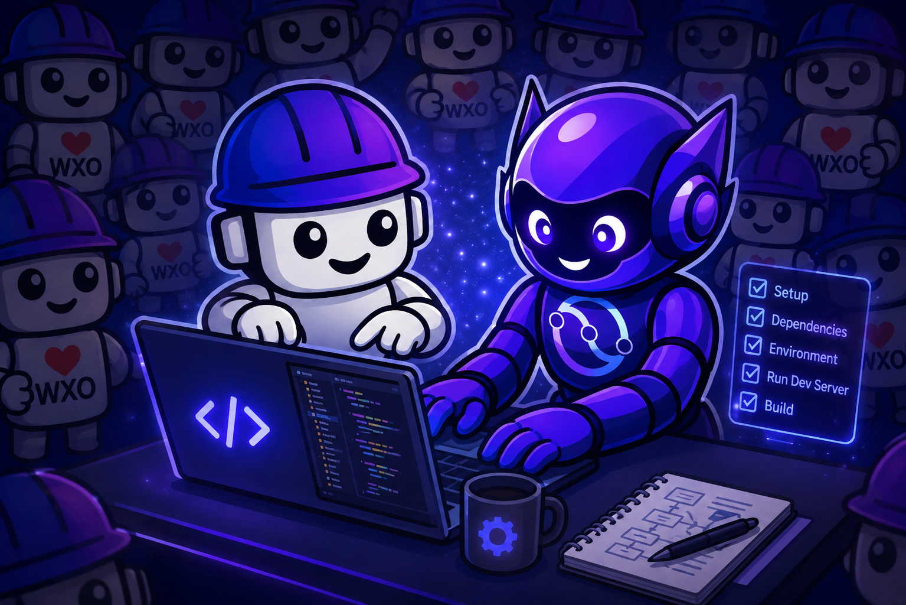
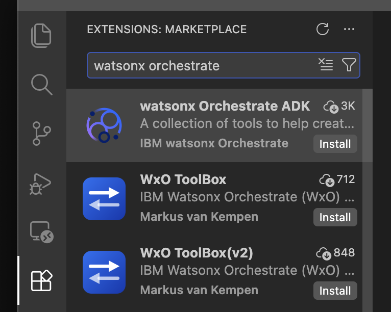
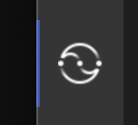

# Setup & Environment

<p align="center">
  
</p>

**Duration:** ~30 minutes · **Difficulty:** ⭐

Everything in this part is preparation. By the end you will have accounts, a configured
Bob IDE workspace, and a working `orchestrate` CLI — the starting line for the lab itself.

---

## Step 1: Create your watsonx Orchestrate instance

Create a free watsonx Orchestrate trial instance. This takes about 5–10 minutes.

### 1.1 Start the trial

Go to [ibm.com/products/watsonx-orchestrate](https://www.ibm.com/products/watsonx-orchestrate)
and click **Start your free trial**.

### 1.2 Sign up with your email address

Enter your email address to create an IBMid.

!!! warning
    Do **not** use **Continue with Google**. Sign up with your email directly —
    social login can cause access problems later in the lab.

### 1.3 Verify your email

1. IBM sends a verification code to your inbox, usually within a minute.
2. Paste the code into the sign-up page and click **Verify**.

!!! tip "No code?"
    Check your spam/junk folder. Wait about 60 seconds before clicking **Resend** —
    requesting several codes in a row invalidates the earlier ones. Always use the most
    recent code.

### 1.4 Complete your account details

Enter your name, country and a password, then accept the terms.

### 1.5 Configure your instance

| Setting | Value |
| --- | --- |
| Name | `openslava-lab-<yourname>` |
| Region | **Frankfurt (eu-de)** |

!!! danger "Use Frankfurt"
    Everyone must use **Frankfurt (eu-de)** so the Confluent connection steps later in
    the lab match.

### 1.6 Finish setup

Click **Complete**. Provisioning takes a minute or two, then you're redirected to your
watsonx Orchestrate home page.

!!! success "Checkpoint"
    You should see the watsonx Orchestrate chat and the **Build** menu. If you don't,
    ask an instructor before continuing.

### Troubleshooting

| Problem | Fix |
| --- | --- |
| Verification code rejected | Request a new code and use only the most recent email. |
| "Account already exists" | Sign in with that IBMid. Use **Forgot password** if needed. |
| Stuck on provisioning | Wait 2–3 minutes, then refresh the page. |

---

## Step 2: Start your IBM Bob trial

IBM Bob is IBM's AI development partner. The free trial runs for **30 days** and includes
**50 Bobcoins**, with no payment details needed. Setup takes about 5 minutes.

Go to [bob.ibm.com/trial](https://bob.ibm.com/trial) and click **Start your free trial**.
Sign in with the **same IBMid** you created in Step 1.

!!! tip
    If you're asked to verify your email again, follow the same steps as in
    [1.3](#13-verify-your-email).

---

## Step 3: Install Bob IDE

Go to [bob.ibm.com/download](https://bob.ibm.com/download) and choose **Bob IDE** for your
operating system:

| OS | Installer |
| --- | --- |
| macOS | **mac-ARM** for Apple silicon (M1 or newer), **mac-Intel** for Intel Macs |
| Windows | **x64 (User)** `.exe` |
| Linux | `.deb` (Debian/Ubuntu) or `.rpm` (Red Hat/Fedora) |

Install it, open it, and sign in with your IBMid.

!!! warning
    You must be logged in to use Bob's AI capabilities throughout the lab. If you hit
    login issues, contact your instructor now rather than later.

Detailed install guide:
[bob.ibm.com/docs/ide/getting-started/install](https://bob.ibm.com/docs/ide/getting-started/install)

---

## Step 4: Verify your Python installation

Open a terminal and run:

```bash
python --version
# or
python3 --version
```

You need Python **3.11, 3.12, or 3.13**. If Python is not installed:

=== "Mac"

    ```bash
    # Using Homebrew (recommended)
    brew install python@3.11

    # Or download the installer from:
    # https://www.python.org/downloads/
    ```

=== "Windows"

    ```powershell
    # Using winget
    winget install Python.Python.3.11

    # Or download the installer from:
    # https://www.python.org/downloads/
    # Check "Add Python to PATH" during installation
    ```

---

## Step 5: Verify your uv installation

```bash
uv --version
```

If `uv` is not installed:

=== "Mac"

    ```bash
    # Using Homebrew
    brew install uv

    # Or using the official installer
    curl -LsSf https://astral.sh/uv/install.sh | sh
    ```

=== "Windows"

    ```powershell
    # Using winget
    winget install astral-sh.uv

    # Or using the official installer (PowerShell)
    powershell -ExecutionPolicy ByPass -c "irm https://astral.sh/uv/install.ps1 | iex"
    ```

After installing, open a **new** terminal and run `uv --version` again to confirm.

---

## Step 6: Download and extract the workshop workspace

The workspace zip *is* your project folder — extracting it creates
`bobchestrate-confluent/` with the `.bob/` configuration and all the pre-built lab code
already in place. You do not need to clone any repository.

1. Download [:material-download: **bobchestrate-confluent.zip**](../lab/bobchestrate-confluent.zip)
2. Extract it to your Desktop or another convenient location:

=== "Mac / Linux"

    ```bash
    cd ~/Desktop
    unzip ~/Downloads/bobchestrate-confluent.zip
    # This creates: ~/Desktop/bobchestrate-confluent/
    ```

=== "Windows"

    ```powershell
    cd $env:USERPROFILE\Desktop
    Expand-Archive -Path "$env:USERPROFILE\Downloads\bobchestrate-confluent.zip" -DestinationPath .
    # This creates: Desktop\bobchestrate-confluent\
    ```

After extracting you have:

```text
bobchestrate-confluent/
├── .bob/                               # Bob IDE configuration (auto-loaded)
│   ├── custom_modes.yaml               # WXO Agent Architect mode
│   ├── mcp.json                        # ADK + docs MCP servers
│   ├── rules/
│   │   └── wxo-dev-rule-enhanced.md    # wxO best-practice rule
│   └── skills/
│       └── wxo-langgraph/              # LangGraph-for-wxO reference skill
└── retail-inventory-optimization/      # Pre-built lab code and data
    ├── pyproject.toml
    ├── uv.lock
    ├── fashion-inventory-consumer/     # Python scripts
    ├── fashion-inventory-setup/        # Schemas, Flink SQL, test data
    └── labs/part2-watsonx-orchestrate/
        └── inventory-alert-demo-knowledge/   # Knowledge base documents
```

!!! note
    The `.bob` folder is hidden in most file explorers because it starts with a dot.
    That's expected — Bob IDE finds it automatically.

### What the `.bob` bundle gives you

| Component | What it does |
| --- | --- |
| **WXO Agent Architect mode** | A Bob chat mode specialised for watsonx Orchestrate development — consults the live wxO docs before answering and uses the ADK MCP server to inspect your environment |
| **`wxo-dev-rule-enhanced`** | A workspace rule that loads watsonx Orchestrate best practices into every Bob response — naming conventions, tool patterns, agent YAML structure, connection setup |
| **`watsonx-orchestrate-adk` MCP server** | Direct access to your wxO environment — list agents, tools and connections, import artifacts, and chat with agents without leaving the IDE |
| **`watsonx-orchestrate-adk-docs` MCP server** | Real-time access to the full watsonx Orchestrate ADK documentation, which Bob searches automatically to verify platform specifics |
| **`wxo-langgraph` skill** | Deep LangGraph-for-wxO knowledge: entry point contract, platform constraints, credential patterns, checkpointers and a troubleshooting reference |

These layers complement each other:

- **Mode** — sets Bob's *persona and behaviour* for a session. It's the "who Bob is" layer.
- **Rule** — sets *always-on constraints* that apply to every response regardless of mode
  or topic, so Bob never generates code that violates wxO conventions.
- **Skill** — provides *deep, topic-specific knowledge* that Bob loads on demand when the
  topic matches, without you having to remind it of the rules.

---

## Step 7: Open the workspace in Bob IDE

1. In Bob IDE, click **File** → **Open Folder**
2. Navigate to the extracted `bobchestrate-confluent` folder and click **Open**
3. Click **Yes, I trust the author** when prompted

The workspace opens with the `.bob/` configuration already active.

---

## Step 8: Create a Python virtual environment

1. Open the Command Palette (`Cmd+Shift+P` / `Ctrl+Shift+P`)
2. Type **"Python: Create Environment"** and select it
3. Choose **Venv**
4. Select Python 3.11, 3.12, or 3.13
5. Wait for the environment to be created

A `.venv` folder appears in your workspace. Bob IDE activates it automatically in all new
terminals — you'll see `(.venv)` in your prompt.

---

## Step 9: Install the watsonx Orchestrate ADK extension

!!! warning "Already have the extension installed?"
    Reload the Bob IDE window first so the extension picks up your new virtual
    environment: Command Palette → **"Developer: Reload Window"**. Then skip ahead to
    [Step 10](#step-10-install-the-watsonx-orchestrate-adk). Do **not** use the extension
    to initialise the workspace.

1. Open the Extensions view (`Cmd+Shift+X` / `Ctrl+Shift+X`) — the icon in the Activity Bar:

    

2. Search for **"watsonx Orchestrate"**
3. Click **Install** on the **watsonx Orchestrate ADK** extension (publisher: IBM watsonx Orchestrate):

    

4. Wait for the installation to complete, and reload Bob IDE if prompted
5. The extension icon appears in the Activity Bar:

    

!!! danger "Do not open the extension"
    You only need it *installed*. Using the extension to initialise the workspace
    conflicts with the pre-built `.bob` configuration and breaks the setup.

The extension provides workspace management, ADK version management, agent and tool file
creation, Developer Edition server control, and the Orchestrate AI Builder Assistant —
none of which you need to open manually for this lab.

---

## Step 10: Install the watsonx Orchestrate ADK

1. Look at the status bar at the bottom of Bob IDE — you should see a red ❌ indicating
   the ADK is not installed in your new virtual environment
2. Click the red ❌
3. Select the option to install the ADK
4. Wait for the installation to complete — the status bar shows a green ✅ with the
   version number

---

## Step 11: Verify Bob's wxO configuration

The workspace already includes the MCP server and mode definitions. Now confirm Bob can
actually use them.

### 11.1 Verify the MCP servers

1. Open Bob's chat panel and select **Agent** or **Ask** mode
2. Ask Bob: `What MCP servers are available?`
3. If Bob asks for permission, select **Approve for task**
4. You should see both listed:
      - `watsonx-orchestrate-adk` — tools for interacting with watsonx Orchestrate
      - `watsonx-orchestrate-adk-docs` — watsonx Orchestrate documentation

### 11.2 Verify the WXO Agent Architect mode

1. Click the mode selector in Bob's chat panel
2. **WXO Agent Architect** should appear in the list
3. Select it and ask: `What can you help me with in this mode?`
4. Bob lists the main topics it covers

### 11.3 Verify the custom development rule

1. Keep **WXO Agent Architect** selected
2. Ask Bob: `What custom rules do you have access to?`
3. You should see the topics from `wxo-dev-rule-enhanced.md` listed

---

## Step 12: Connect the ADK to your watsonx Orchestrate environment

### 12.1 Get your credentials

**API key:**

1. In the wxO console, click your **profile icon** (top-right)
2. Select **Settings** → **API details**
3. Click **Generate API key**, then **Copy** immediately
4. Store it securely — it is shown only once

**Instance URL:** copy the **Service instance URL** from the same API details page.

### 12.2 Add and activate the environment

=== "Using the ADK CLI"

    Open a terminal in Bob IDE (**Terminal** → **New Terminal**) and run:

    ```bash
    # Add your environment
    orchestrate env add -n openslava-lab -u <your-instance-url>

    # Activate it
    orchestrate env activate openslava-lab -a <your-api-key>
    ```

    You should see: `[INFO] Environment 'openslava-lab' is now active`

=== "Using Bob"

    1. Make sure **WXO Agent Architect** mode is selected in Bob's chat
    2. Ask Bob:

        ```
        Create a simple shell script to add and activate a new watsonx Orchestrate SaaS
        environment for the ADK. I have the environment URL and API key ready.
        ```

    3. Bob will ask permission to use the wxO documentation MCP server, write the script,
       and make it executable — **grant access** so it can finish the task
    4. Follow Bob's instructions to run the script

!!! warning "Authentication expires every two hours"
    When it expires, re-run `orchestrate env activate` with your API key. Keep the key
    handy — you'll need it again during the lab.

### 12.3 Verify the connection

```bash
orchestrate agents list
```

Any output without an error — including an empty list — means you're connected.

---

## You're ready when

- [ ] `orchestrate agents list` returns without error
- [ ] Bob responds and **WXO Agent Architect** appears in the mode selector
- [ ] Both MCP servers show as available
- [ ] `bobchestrate-confluent/` is open in Bob IDE with `.venv` created
- [ ] You have a Confluent Cloud account ready (free trial is fine)

---

## Troubleshooting

??? failure "`orchestrate: command not found`"
    The ADK isn't installed, or isn't on your PATH. Make sure your virtual environment is
    active, then reinstall:

    ```bash
    pip install ibm-watsonx-orchestrate
    ```

??? failure "`Authentication failed` or `401 Unauthorized`"
    Your wxO session has expired — sessions last two hours. Re-activate:

    ```bash
    orchestrate env activate openslava-lab -a <your-api-key>
    ```

??? failure "Bob isn't responding, or MCP servers show red"
    1. Check MCP server status via Command Palette → **"MCP Servers"**
    2. Confirm `.bob/mcp.json` exists in the open workspace folder
    3. Restart Bob IDE if it stays unresponsive

??? failure "`.bob` folder not found / WXO Agent Architect mode missing"
    The `.bob` folder must sit at the root of the folder you opened in Bob IDE:

    === "Mac / Linux"

        ```bash
        ls -la bobchestrate-confluent/
        # You should see: .bob/  .venv/  retail-inventory-optimization/
        ```

    === "Windows"

        ```powershell
        Get-ChildItem -Force bobchestrate-confluent\
        # You should see: .bob  .venv  retail-inventory-optimization
        ```

    If it's missing, redo [Step 6](#step-6-download-and-extract-the-workshop-workspace) and
    extract into a fresh location.

---

## Quick reference

```bash
# Check ADK version
orchestrate --version

# Add wxO environment
orchestrate env add -n openslava-lab -u <instance-url>

# Activate wxO environment (re-run every 2 hours)
orchestrate env activate openslava-lab -a <api-key>

# List environments, agents, tools, connections
orchestrate env list
orchestrate agents list
orchestrate tools list
orchestrate connections list

# Help
orchestrate --help
```

---

## Additional resources

- [watsonx Orchestrate ADK documentation](https://developer.watson-orchestrate.ibm.com/)
- [IBM Bob IDE documentation](https://bob.ibm.com/docs)
- [Confluent Cloud documentation](https://docs.confluent.io/cloud/current/overview.html)

---

[Continue to the lab →](../lab/index.md){ .md-button .md-button--primary }
